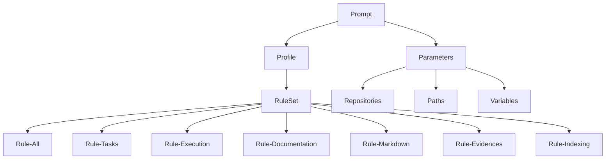
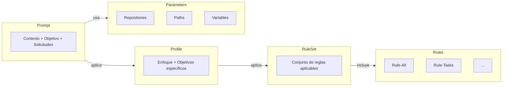
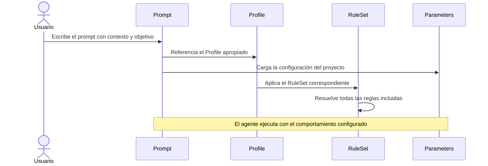
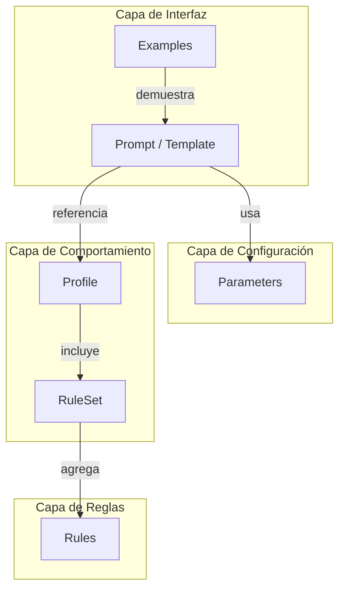

# Guía Conceptual — Prompt Framework

## Tabla de contenidos

- [Propósito](#propósito)
- [Filosofía](#filosofía)
- [Arquitectura](#arquitectura)
- [Componentes](#componentes)
- [Jerarquía de composición](#jerarquía-de-composición)
- [Flujo de trabajo](#flujo-de-trabajo)
- [Interacción entre componentes](#interacción-entre-componentes)
- [Referencia rápida](#referencia-rápida)

---

## Propósito

El Prompt Framework es una metodología para construir prompts complejos de forma consistente, reutilizable y mantenible.

Su objetivo es estandarizar la manera en que se comunican instrucciones a un agente de inteligencia artificial, separando:

- la **descripción del problema** (qué hacer);
- el **comportamiento del agente** (cómo hacerlo);
- la **configuración del proyecto** (en qué contexto hacerlo).

El framework permite reutilizar instrucciones en múltiples proyectos sin duplicar conocimiento ni mantener múltiples versiones de las mismas reglas.

---

## Filosofía

El framework se basa en tres principios fundamentales.

### Separación de responsabilidades

Cada componente tiene una única responsabilidad bien definida.

Los prompts describen el problema. Los perfiles configuran el comportamiento. Las reglas definen las restricciones. Los parámetros aportan el contexto del proyecto.

### Composición sobre duplicación

Los componentes se componen para formar comportamientos complejos.

En lugar de repetir instrucciones en cada prompt, se reutilizan perfiles y reglas existentes.

### Independencia del proyecto

Las reglas y perfiles son independientes de cualquier proyecto concreto.

Los parámetros permiten adaptar el framework a cada proyecto sin modificar su lógica.

---

## Arquitectura

La arquitectura define cuatro capas:

| Capa | Componente | Responsabilidad |
|------|------------|-----------------|
| 1 | Prompt | Describe qué se necesita hacer |
| 2 | Profile | Configura cómo se comporta el agente |
| 3 | RuleSet | Define qué reglas aplican |
| 4 | Rules | Establece el comportamiento esperado |

Los **Parameters** no forman parte de la jerarquía de reglas sino del contexto del proyecto. Se resuelven de forma independiente.

---

## Componentes

### Parameters

Los parámetros representan la configuración del proyecto.

Permiten que las reglas y perfiles sean independientes de implementaciones concretas.

| Archivo | Propósito |
|---------|-----------|
| `Parameters.md` | Descripción del sistema de parámetros |
| `Repositories.md` | Define los repositorios del proyecto |
| `Paths.md` | Define las rutas relevantes |
| `Variables.md` | Define variables generales |

Cada proyecto que utilice el framework deberá completar estos archivos con su configuración específica.

### Rules

Las reglas son el componente atómico del framework.

Cada regla define un conjunto de instrucciones para un dominio específico.

| Regla | Dominio |
|-------|---------|
| `Rule-All.md` | Comportamiento general transversal |
| `Rule-Tasks.md` | Planificación y descomposición de tareas |
| `Rule-Execution.md` | Ejecución ordenada de tareas |
| `Rule-Documentation.md` | Generación de documentación técnica |
| `Rule-Markdown.md` | Formato y estructura Markdown |
| `Rule-Evidences.md` | Trazabilidad y verificabilidad |
| `Rule-Indexing.md` | Gestión de la base de conocimiento |

Las reglas no se utilizan directamente en los prompts. Se aplican a través de RuleSets.

### RuleSets

Un RuleSet es una colección de reglas agrupadas para un tipo de tarea.

| RuleSet | Dominio |
|---------|---------|
| `RuleSet-Default.md` | Conjunto base aplicado en toda operación |
| `RuleSet-Documentation.md` | Tareas de documentación técnica |
| `RuleSet-Development.md` | Tareas de desarrollo y revisión de código |
| `RuleSet-Audit.md` | Auditorías técnicas de infraestructura |

Todo RuleSet especializado incluye las reglas del RuleSet Default más sus comportamientos específicos.

Los RuleSets no se utilizan directamente en los prompts. Se aplican a través de Profiles.

### Profiles

Un Profile configura el comportamiento completo del agente para un tipo de trabajo específico.

Cada Profile referencia un RuleSet, define el enfoque de trabajo, establece los objetivos específicos y describe el resultado esperado.

| Profile | Propósito |
|---------|-----------|
| `Repository-Documentation.md` | Documentar repositorios de software |
| `Infrastructure-Documentation.md` | Documentar infraestructuras tecnológicas |
| `Infrastructure-Audit.md` | Auditar infraestructuras sin modificarlas |
| `Docker-Documentation.md` | Documentar infraestructuras Docker |
| `Architecture-Review.md` | Analizar arquitecturas de software |
| `Code-Review.md` | Revisar código fuente |

Los Profiles son el punto de entrada recomendado para configurar el comportamiento del agente desde un Prompt.

### Templates

Los Templates son estructuras vacías que guían la construcción de nuevos prompts.

| Template | Propósito |
|---------|-----------|
| `Prompt-Template.md` | Estructura completa para prompts complejos |
| `Prompt-Minimal.md` | Estructura mínima para prompts simples |
| `Prompt-Example.md` | Ejemplo completo de un prompt funcional |

### Prompts

Los Prompts son instrucciones predefinidas para tareas comunes y reutilizables.

| Prompt | Propósito |
|--------|-----------|
| `Actualizar-Documentacion.md` | Actualizar documentación existente |
| `Documentar-Docker.md` | Documentar una infraestructura Docker |
| `Documentar-Servidor.md` | Documentar un servidor Linux |
| `Revisar-Seguridad.md` | Realizar una revisión de seguridad |

### Examples

Los Examples son prompts completos y funcionales que demuestran el uso del framework en escenarios reales.

| Ejemplo | Escenario |
|---------|-----------|
| `Example-Auditoria.md` | Auditoría técnica de un servidor Linux |
| `Example-Documentar-Infra.md` | Documentación de una infraestructura Linux con Docker |

### Guides

Las guías documentan el framework en sí.

| Guía | Audiencia |
|------|-----------|
| `Readme.md` | Todos — arquitectura y conceptos del framework |
| `User-Guide.md` | Usuarios — cómo usar el framework |
| `Develop-Guide.md` | Desarrolladores — cómo extender el framework |

---

## Jerarquía de composición

Un Prompt combina:

1. **Contexto** — información sobre el problema
2. **Objetivo** — resultado esperado
3. **Solicitudes** — tareas a realizar
4. **Restricciones** — limitaciones de la ejecución
5. **Profile** — configuración del comportamiento del agente
6. **Parameters** — configuración del proyecto

---

## Flujo de trabajo

### Paso 1 — Identificar el tipo de tarea

Determinar qué tipo de trabajo se necesita realizar:

- ¿Documentación? → Profiles de documentación
- ¿Auditoría? → Profile de auditoría
- ¿Revisión de código? → Profile de code review
- ¿Revisión arquitectónica? → Profile de architecture review

### Paso 2 — Seleccionar el Profile

Elegir el Profile que mejor se adapte al tipo de trabajo.

Si no existe un Profile apropiado, utilizar el Template y referenciar el RuleSet adecuado.

### Paso 3 — Completar los Parameters

Asegurarse de que los archivos de Parameters estén completos para el proyecto:
repositorios, rutas y variables relevantes.

### Paso 4 — Construir el Prompt

Utilizar un Template como estructura base y completar contexto, objetivo, solicitudes, restricciones, Profile y Parameters.

### Paso 5 — Ejecutar

Proporcionar el prompt al agente. El agente resolverá automáticamente la cadena:
`Profile → RuleSet → Rules → Parameters`.

---

## Interacción entre componentes

---

## Referencia rápida

| Pregunta | Respuesta |
|----------|-----------|
| ¿Cuándo usar un Profile? | Siempre que sea posible. Encapsulan el comportamiento completo para un tipo de tarea. |
| ¿Cuándo usar un RuleSet directamente? | Al construir un nuevo Profile o cuando ningún Profile existente se adapte al caso. |
| ¿Cuándo usar Rules directamente? | Nunca desde un Prompt. Las Rules siempre se aplican a través de RuleSets. |
| ¿Cuándo usar un Template? | Para construir prompts nuevos. Proveen la estructura correcta. |
| ¿Cuándo usar un Prompt predefinido? | Cuando la tarea coincida con una tarea común en la carpeta `Prompts/`. |
| ¿Cuándo consultar los Examples? | Antes de crear un prompt nuevo, para entender patrones funcionales probados. |
