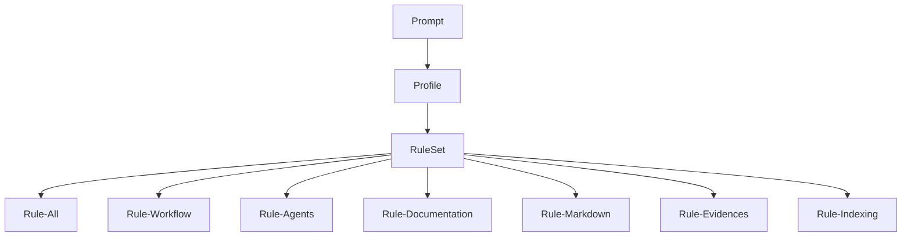
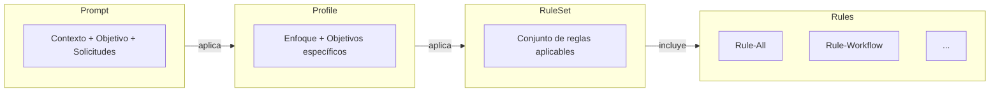
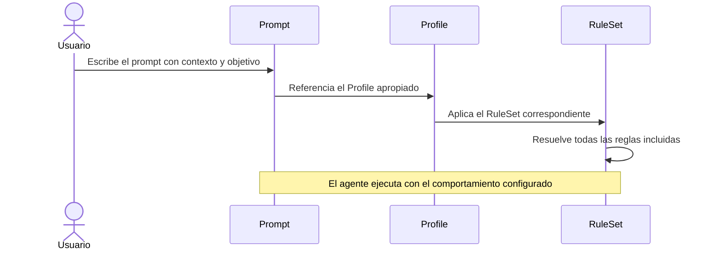
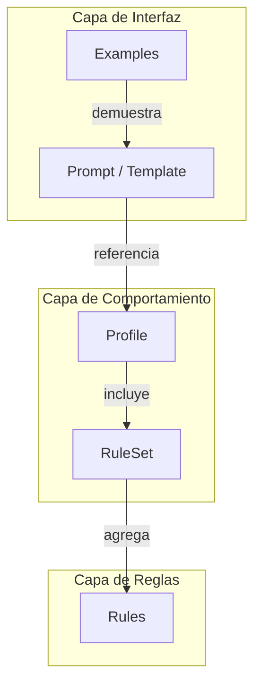

# Guía Conceptual — Prompt Framework

## Tabla de contenidos

- [Propósito](#propósito)
- [Filosofía](#filosofía)
- [Arquitectura](#arquitectura)
- [Componentes](#componentes)
- [Jerarquía de composición](#jerarquía-de-composición)
- [Flujo de trabajo](#flujo-de-trabajo)
- [Interacción entre componentes](#interacción-entre-componentes)
- [Referencia rápida](#referencia-rápida)
- [Uso por agentes automáticos](#uso-por-agentes-automáticos)

---

## Propósito

El Prompt Framework es una metodología para construir prompts complejos de forma consistente, reutilizable y mantenible.

Su objetivo es estandarizar la manera en que se comunican instrucciones a un agente de inteligencia artificial, separando:

- la **descripción del problema** (qué hacer);
- el **comportamiento del agente** (cómo hacerlo).

El framework permite reutilizar instrucciones en múltiples proyectos sin duplicar conocimiento ni mantener múltiples versiones de las mismas reglas.

---

## Filosofía

El framework se basa en tres principios fundamentales.

### Separación de responsabilidades

Cada componente tiene una única responsabilidad bien definida.

Los prompts describen el problema. Los perfiles configuran el comportamiento. Las reglas definen las restricciones.

### Composición sobre duplicación

Los componentes se componen para formar comportamientos complejos.

En lugar de repetir instrucciones en cada prompt, se reutilizan perfiles y reglas existentes.

### Independencia del proyecto

Las reglas y perfiles son independientes de cualquier proyecto concreto.

El contexto específico de cada proyecto se aporta en el propio prompt, sin modificar la lógica del framework.

---

## Arquitectura



La arquitectura define cuatro capas:

| Capa | Componente | Responsabilidad |
|------|------------|-----------------|
| 1 | Prompt | Describe qué se necesita hacer |
| 2 | Profile | Configura cómo se comporta el agente |
| 3 | RuleSet | Define qué reglas aplican |
| 4 | Rules | Establece el comportamiento esperado |

---

## Componentes

### Rules

Las reglas son el componente atómico del framework.

Cada regla define un conjunto de instrucciones para un dominio específico.

| Regla | Dominio |
|-------|---------|
| `Rule-All.md` | Comportamiento general transversal |
| `Rule-Workflow.md` | Ciclo de trabajo: diagnóstico, plan, ejecución, validación y reporteo |
| `Rule-Agents.md` | Asignación de subagentes autoajustada a la tarea |
| `Rule-Documentation.md` | Generación de documentación técnica |
| `Rule-Markdown.md` | Formato y estructura Markdown |
| `Rule-Evidences.md` | Trazabilidad y verificabilidad |
| `Rule-Indexing.md` | Gestión de la base de conocimiento |
| `Rule-Dual-Audience.md` | Documentación de doble audiencia: humanos y agentes de IA |
| `Rule-Drift-Control.md` | Control de deriva: contrato de ejecución, sensores y re-anclaje |

Las reglas no se utilizan directamente en los prompts. Se aplican a través de RuleSets.

### RuleSets

Un RuleSet es **solo una lista de Rules** agrupadas para un tipo de tarea; el énfasis lo define el Profile, no el RuleSet. Cada uno carga solo las Rules que su dominio necesita, para que el consumo de tokens sea proporcional a la tarea.

| RuleSet | Rules que carga |
|---------|-----------------|
| `RuleSet-Lean.md` | All, Workflow (tier liviano para tareas simples) |
| `RuleSet-Default.md` | All, Workflow, Evidences, Markdown |
| `RuleSet-Documentation.md` | Default + Documentation, Indexing, Agents |
| `RuleSet-Solution-Documentation.md` | Documentation + Dual-Audience, Drift-Control |
| `RuleSet-Development.md` | Default + Agents |
| `RuleSet-Audit.md` | Default + Indexing, Agents |

Los RuleSets especializados extienden Default con las Rules de su dominio; `Lean` es un subconjunto de Default.

Los RuleSets no se utilizan directamente en los prompts (se aplican a través de Profiles), salvo `Lean`, que puede referenciarse directo en prompts de análisis simple.

### Profiles

Un Profile configura el comportamiento completo del agente para un tipo de trabajo específico.

Cada Profile referencia un RuleSet, define el enfoque de trabajo, establece los objetivos específicos y describe el resultado esperado.

| Profile | Propósito |
|---------|-----------|
| `Solution-Documentation.md` | Documentar soluciones completas conforme al Marco de Documentación (orquestación por pieza) |
| `Repository-Documentation.md` | Documentar repositorios de software |
| `Infrastructure-Documentation.md` | Documentar infraestructuras tecnológicas |
| `Infrastructure-Audit.md` | Auditar infraestructuras sin modificarlas |
| `Docker-Documentation.md` | Documentar infraestructuras Docker |
| `Database-Documentation.md` | Documentar bases de datos (diccionario + ER en dbml) |
| `QA-Test-Design.md` | Derivar casos y datos de prueba desde el modelo de datos |
| `Architecture-Review.md` | Analizar arquitecturas de software |
| `Code-Review.md` | Revisar código fuente |
| `Knowledge-Indexing.md` | Construir y mantener la base de conocimiento (ia-db) |

Los Profiles son el punto de entrada recomendado para configurar el comportamiento del agente desde un Prompt.

### Templates

Los Templates son estructuras vacías que guían la construcción de nuevos prompts.

| Template | Propósito |
|---------|-----------|
| `Prompt-Template.md` | Estructura completa para prompts complejos |
| `Prompt-Minimal.md` | Estructura mínima para prompts simples |
| `Prompt-Example.md` | Ejemplo completo de un prompt funcional |

Los tres usan el **núcleo de 5 secciones** (`Contexto · Objetivo · Solicitudes · Restricciones · Framework`). Ver [How-To](How-To.md) para completarlas.

### Tool-Prompts

Los Tool-Prompts son prompts-herramienta de invocación directa, ubicados en `/IA/IA.Prompts/Tool-Prompts/` (fuera de `PromptFramework/`). Se ejecutan con una sola línea en el chat, sin copiar ni completar plantillas:

```
Ejecuta /IA/IA.Prompts/Tool-Prompts/Iniciar-Contexto.md en <tema>
```

| Tool-Prompt | Propósito |
|-------------|-----------|
| `Iniciar-Contexto.md` | Arrancar un chat cargando el contexto mínimo de un tema |
| `Iniciar-Indexado.md` | Generar la ia-db de uno o más proyectos (modo proyecto o workspace federado) |
| `Actualizar-Indexado.md` | Sincronizar una ia-db existente con los cambios de sus proyectos |
| `Documentar-Servidor.md` | Documentar un servidor Linux |
| `Documentar-Docker.md` | Documentar una infraestructura Docker |
| `Documentar-BaseDatos.md` | Documentar la estructura de una base de datos (diccionario + ER en dbml) |
| `Derivar-Casos-Prueba.md` | Derivar casos y datos de prueba (QA) desde el modelo de datos |
| `Documentar-Fuentes-Software.md` | Evaluar y documentar una solución, proyecto o workspace completo (ia-db + conjunto documental) |
| `Actualizar-Documentacion.md` | Actualizar documentación existente de un proyecto |
| `Revisar-Seguridad.md` | Revisión de seguridad (solo lectura) |

Ver el catálogo completo con invocación y Profile de cada uno en `/IA/IA.Prompts/Tool-Prompts/README.md`.

`Iniciar-Contexto.md` es autónomo (no carga Profiles ni RuleSets) para minimizar el consumo de tokens; es la excepción documentada a la jerarquía del framework. Ver la [Guía de Optimización de Tokens](Token-Optimization.md).

### Examples

Los Examples son prompts completos y funcionales que demuestran el uso del framework en escenarios reales. Los `Example-*` son ejemplos pulidos que reutilizan un Profile o RuleSet.

| Ejemplo | Escenario |
|---------|-----------|
| `Example-Auditoria.md` | Auditoría técnica de un servidor Linux |
| `Example-Mantener-Guias.md` | Mantenimiento de las guías del framework |

Catálogo completo: `/IA/IA.Prompts/PromptFramework/Examples/README.md`.

### Guides

Las guías documentan el framework en sí.

| Guía | Audiencia |
|------|-----------|
| `Readme.md` | Todos — arquitectura y conceptos del framework |
| `How-To.md` | Todos — escribir prompts y extender el framework (copy-paste) |
| `User-Guide.md` | Usuarios — cómo usar el framework |
| `Develop-Guide.md` | Desarrolladores — cómo extender el framework |
| `Token-Optimization.md` | Todos — cómo minimizar el consumo de contexto (técnica ia-db) |

---

## Jerarquía de composición



Un Prompt combina:

1. **Contexto** — información sobre el problema
2. **Objetivo** — resultado esperado
3. **Solicitudes** — tareas a realizar
4. **Restricciones** — limitaciones de la ejecución
5. **Profile** — configuración del comportamiento del agente

---

## Flujo de trabajo



### Paso 1 — Identificar el tipo de tarea

Determinar qué tipo de trabajo se necesita realizar:

- ¿Documentación? → Profiles de documentación
- ¿Auditoría? → Profile de auditoría
- ¿Revisión de código? → Profile de code review
- ¿Revisión arquitectónica? → Profile de architecture review

### Paso 2 — Seleccionar el Profile

Elegir el Profile que mejor se adapte al tipo de trabajo.

Si no existe un Profile apropiado, utilizar el Template y referenciar el RuleSet adecuado.

### Paso 3 — Construir el Prompt

Utilizar un Template como estructura base y completar contexto, objetivo, solicitudes, restricciones y Profile.

### Paso 4 — Ejecutar

Proporcionar el prompt al agente. El agente resolverá automáticamente la cadena:
`Profile → RuleSet → Rules`.

---

## Interacción entre componentes



---

## Referencia rápida

| Pregunta | Respuesta |
|----------|-----------|
| ¿Cuándo usar un Profile? | Siempre que sea posible. Encapsulan el comportamiento completo para un tipo de tarea. |
| ¿Cuándo usar un RuleSet directamente? | Al construir un nuevo Profile o cuando ningún Profile existente se adapte al caso. |
| ¿Cuándo usar Rules directamente? | Nunca desde un Prompt. Las Rules siempre se aplican a través de RuleSets. |
| ¿Cuándo usar un Template? | Para construir prompts nuevos. Proveen la estructura correcta. |
| ¿Cuándo usar un Tool-Prompt? | Para tareas recurrentes (documentar, indexar, auditar, iniciar contexto) invocables en una línea. |
| ¿Cuándo referenciar un RuleSet directo? | Solo si ningún Profile encaja; típico de `Lean` en análisis simple. |
| ¿Cuándo consultar los Examples? | Antes de crear un prompt nuevo, para entender patrones funcionales probados. |

---

## Uso por agentes automáticos

Al recibir un prompt del framework, el agente resuelve la cadena `Profile → RuleSet → Rules` antes de ejecutar:

| Paso | Acción |
|------|--------|
| 1 | Leer la sección `# Framework` del prompt: referencia un Profile (caso general) o un RuleSet directo (típico de `RuleSet-Lean` en análisis simple). |
| 2 | Cargar el Profile referenciado y localizar su sección `## Rule Set`. Si el prompt referencia un RuleSet directo, omitir este paso. |
| 3 | Cargar el RuleSet: es solo una lista de Rules. |
| 4 | Cargar todas las Rules listadas y ejecutar con ese comportamiento. El énfasis y los criterios de calidad los fija el Profile; sin Profile, aplican las Rules y lo que el propio prompt indique. |

Las rutas de los componentes son absolutas con base `/IA/IA.Prompts` (ver las [convenciones de la Guía de Desarrollo](Develop-Guide.md#convenciones)).

Cuándo consultar la [Referencia rápida](#referencia-rápida):

| Situación | Qué resuelve |
|-----------|--------------|
| El prompt no referencia ningún componente | Qué nivel referenciar: Profile → RuleSet; nunca Rules directas |
| Hay que construir o proponer un prompt nuevo | Qué Template usar y qué Examples consultar |
| La tarea es recurrente | Si existe un Tool-Prompt que ya la resuelva en una línea |
