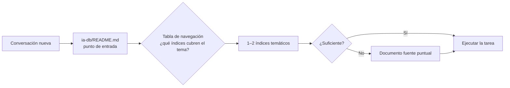

# Guía de Optimización de Tokens — Prompt Framework

## Tabla de contenidos

- [Propósito](#propósito)
- [Principios](#principios)
- [La técnica ia-db](#la-técnica-ia-db)
- [Qué cargar según la tarea](#qué-cargar-según-la-tarea)
- [Prácticas al escribir componentes](#prácticas-al-escribir-componentes)
- [Prácticas al ejecutar prompts](#prácticas-al-ejecutar-prompts)

---

## Propósito

El costo dominante al trabajar con agentes de IA es el contexto: cada archivo cargado consume tokens, y el contexto releído en cada conversación se paga una y otra vez.

Esta guía define cómo el framework minimiza ese costo sin perder calidad: indexando el conocimiento una vez (`ia-db`) y recuperándolo de forma incremental en cada conversación.

---

## Principios

1. **Indexar una vez, recuperar muchas** — el costo de generar la ia-db se amortiza en cada conversación que evita releer las fuentes.
2. **Recuperación incremental** — punto de entrada → índices del tema → documentos fuente, y solo si el nivel anterior resulta insuficiente.
3. **Referenciar antes que incluir** — un prompt cita rutas de Profiles; no copia su contenido.
4. **Destilar, no copiar** — un índice condensa; el detalle vive en la fuente y se referencia.
5. **Presupuestos explícitos** — cada índice tiene un tamaño máximo orientativo; lo que no entra, se referencia.
6. **Cargar reglas proporcionales a la tarea** — una tarea trivial no justifica resolver la cadena completa Profile → RuleSet → Rules.

---

## La técnica ia-db

Implementación de referencia: `/Discord.Bot.Moderador.Core.Documentos/ia-db`. Estructura canónica definida en `/IA.Prompting.Templates/PromptFramework/Profiles/Knowledge-Indexing.md`.

Por qué funciona:

| Sin ia-db | Con ia-db |
|-----------|-----------|
| Releer código y documentación en cada chat | Leer 1 punto de entrada + 1–2 índices |
| Contexto proporcional al tamaño del repositorio | Contexto proporcional al tema consultado |
| Conocimiento inferido de nuevo cada vez (con riesgo de inconsistencia) | Conocimiento destilado, versionado y trazable |

Los Tool-Prompts operativos de la técnica:

| Operación | Tool-Prompt |
|-----------|-------------|
| Crear la ia-db | `/IA.Prompting.Templates/Tool-Prompts/Iniciar-Indexado.md` |
| Sincronizarla con cambios | `/IA.Prompting.Templates/Tool-Prompts/Actualizar-Indexado.md` |
| Arrancar un chat con contexto mínimo | `/IA.Prompting.Templates/Tool-Prompts/Iniciar-Contexto.md` |

---

## Qué cargar según la tarea

| Situación | Qué cargar | Qué no cargar |
|-----------|------------|----------------|
| Inicio de conversación sobre un tema | `Iniciar-Contexto` (ia-db: entrada + índices del tema) | Profiles, RuleSets, código fuente |
| Consulta puntual y acotada | `Prompt-Minimal.md` + Profile | Índices no relacionados con el tema |
| Documentación, auditoría o revisión completa | `Prompt-Template.md` + Profile (cadena completa) | Documentos fuente que la ia-db ya condensa, salvo verificación |
| Creación o actualización de la ia-db | Tool-Prompt de indexado + Profile `Knowledge-Indexing` | — |

Regla general: el Profile determina el **comportamiento** y se carga una vez; el **contexto del proyecto** se recupera vía ia-db según el tema, no por barrido del repositorio.

---

## Prácticas al escribir componentes

- **Una pantalla de resumen primero**: todo punto de entrada (README, índice maestro) debe responder «¿qué es esto?» en la primera pantalla.
- **Tablas y árboles sobre prosa**: condensan más información por token y se escanean mejor.
- **Sin duplicación entre documentos**: un dato vive en un solo lugar; el resto lo referencia. Dos puntos de entrada con el mismo contenido duplican el costo de mantenerlos y de cargarlos.
- **Reglas atómicas y cortas**: si una Rule crece más allá de su dominio, dividirla; los prompts pagan cada línea de cada regla cargada.
- **Placeholders en lugar de casos**: un Tool-Prompt parametrizado con `{tema}` reemplaza N prompts casi idénticos.
- **Pie de vigencia**: fecha y versión en los índices evitan verificaciones redundantes («¿esto sigue vigente?»).

---

## Prácticas al ejecutar prompts

- Consultar la ia-db **antes** de explorar el repositorio.
- No cargar la totalidad de la documentación cuando solo se necesita una parte (ver `Rule-Indexing.md`).
- Ampliar contexto solo ante insuficiencia comprobada, no preventivamente.
- Al finalizar tareas que cambien el conocimiento del proyecto, actualizar la ia-db (o proponer ejecutar `Actualizar-Indexado`) para que la próxima conversación arranque barata.
