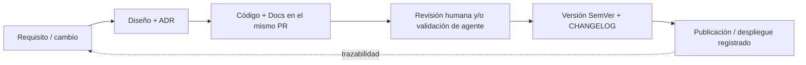
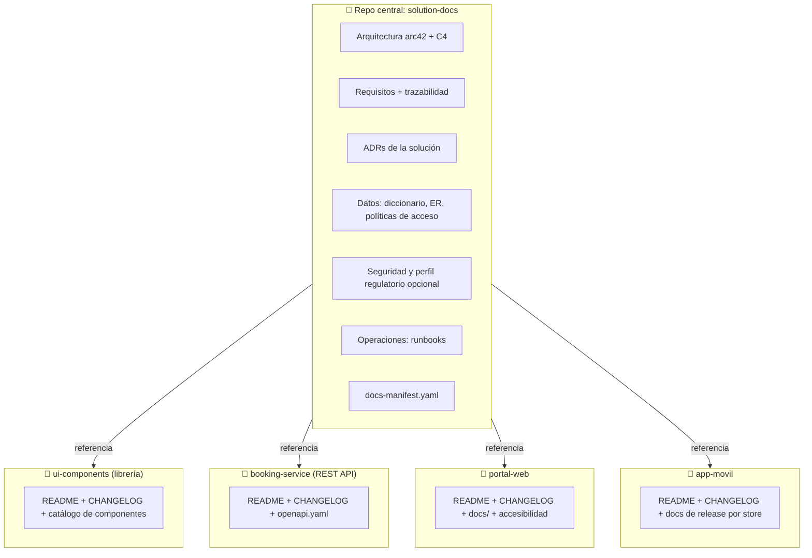
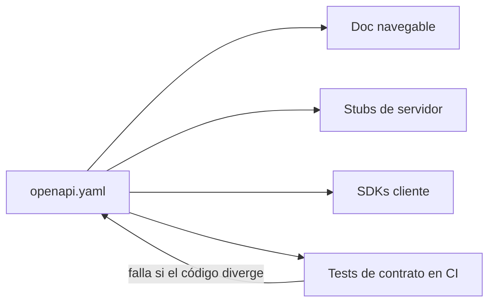
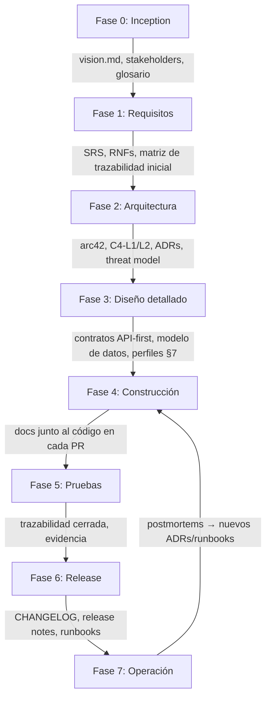
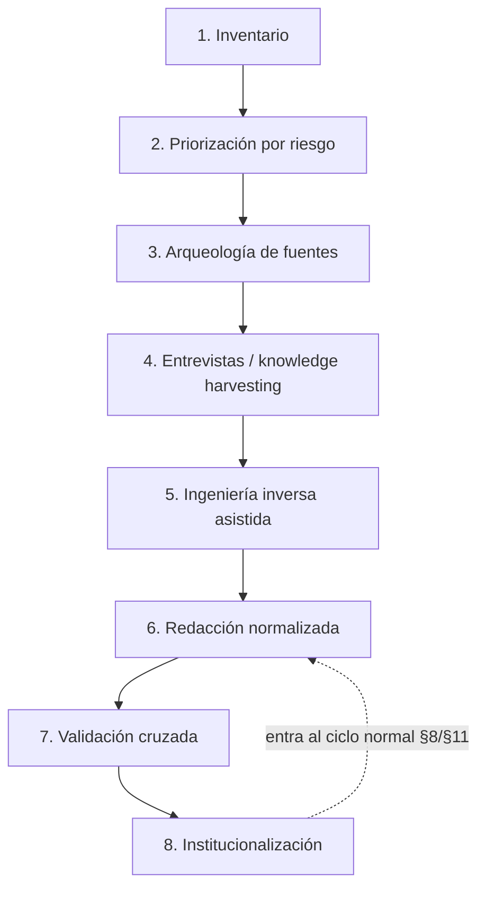
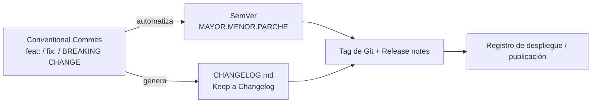
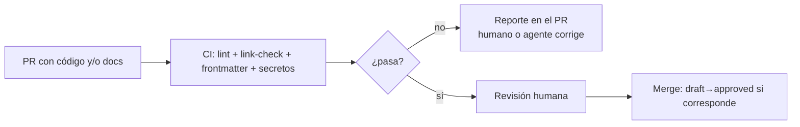
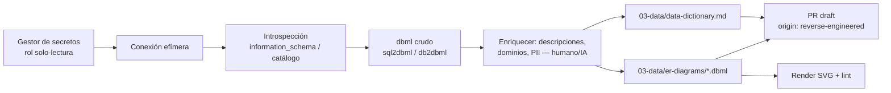
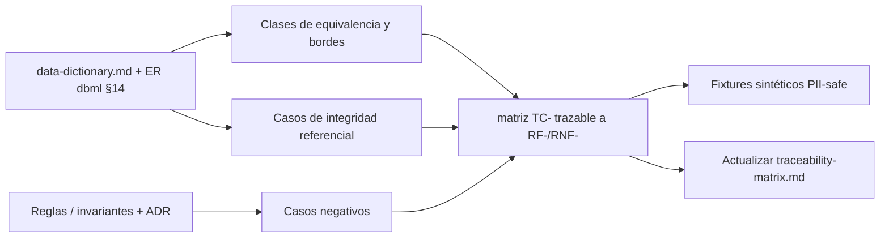

# Marco de Documentación de Soluciones de Software

> Aplica a soluciones **multi-proyecto de cualquier tipo**: portales web, aplicaciones móviles, librerías y librerías de componentes UI, servicios/REST APIs, procesos batch y sistemas de gestión (p. ej., gestión de turnos). Los dominios regulados (banca, salud) se tratan como **perfil opcional**, no como supuesto.

---

## 1. Introducción y alcance

Este documento es un **marco de documentación** con doble propósito:

1. **Guía para trabajo manual:** define criterios, estándares, estructura de repositorio y procesos para que equipos humanos documenten soluciones de software durante todo su ciclo de vida.
2. **Marco para agentes automáticos:** define un contrato máquina-legible (metadatos, IDs, manifiesto, reglas de validación) para que agentes de documentación automática generen, actualicen y verifiquen documentación de forma consistente con el trabajo humano.

**Alcance:** una *solución* se entiende como un sistema compuesto por múltiples piezas de software de tipos heterogéneos. Ejemplos de piezas: portal web público, backoffice, app móvil iOS/Android, librería de componentes UI, librería de dominio compartida, servicio REST, worker/batch, base de datos.

| Sección | Contenido |
|---|---|
| 2 | Cómo usar este documento (modo humano / modo agente) |
| 3 | Criterios de calidad documental |
| 4 | Estándares aplicables (resumen → fichas en Anexo A) |
| 5 | Estructura documental del repositorio |
| 6 | Especificación de REST APIs y contratos |
| 7 | Perfiles documentales por tipo de pieza |
| 8 | Documentar desde cero (greenfield) |
| 9 | Software no documentado (legacy): relevamiento y normalización |
| 10 | Criterios para código asistido por IA |
| 11 | Ciclo de vida, versionado y registro de actualizaciones |
| 12 | Optimización para agentes de documentación automática |
| 13 | Extracción de piezas de código representativas |
| 14 | Documentación de base de datos: conexión → diccionario y ER (dbml) |
| 15 | Derivación de casos y datos de prueba desde el modelo de datos (QA) |
| 16 | Checklist operativo |
| Anexo A | Referencia breve de normas y marcos (fichas parseables) |



---

## 2. Cómo usar este documento

### 2.1 Modo humano

- Leer secciones 3–5 al iniciar un proyecto; usar la sección 7 para saber qué documentar según el tipo de pieza; seguir la 8 (nuevo) o la 9 (legacy) como proceso.
- Las **preguntas guía** de cada sección sirven para formar criterio en revisiones y retrospectivas.

### 2.2 Modo agente

Un agente de documentación automática debe tratar este documento como su **política raíz**:

1. Leer el **frontmatter YAML** de cada documento para conocer estado, owner y trazabilidad (§12.1).
2. Consultar el **manifiesto** `docs-manifest.yaml` para saber qué documentos existen, cuáles faltan y qué plantilla usar (§12.2).
3. Decidir qué normas aplican usando las **fichas del Anexo A** (campo `trigger`).
4. Generar solo en estado `draft`; la promoción a `approved` requiere humano (§12.4).
5. Ejecutar las **validaciones** del bloque «🤖 Para agentes» de la sección correspondiente antes de proponer cambios.

> **Convención de este documento:** cada sección termina con un bloque «🤖 Para agentes» con `entradas`, `salidas` y `validaciones`. Los humanos pueden ignorarlos; los agentes deben cumplirlos.

---

## 3. Criterios de calidad documental

### 3.1 Definiciones

- **Trazabilidad:** seguir un requerimiento hasta diseño, código, pruebas y despliegue, y viceversa.
- **Auditabilidad:** todo cambio con autor, fecha, motivo y aprobación verificables.
- **Docs-as-code:** documentación tratada con las herramientas y procesos del código (Git, PRs, CI).
- **Fuente única de verdad (SSOT):** cada hecho se documenta en un solo lugar; el resto enlaza.
- **Owner:** persona/equipo responsable de la vigencia de un documento.

### 3.2 Criterios

| Criterio | Qué exige | Ejemplo |
|---|---|---|
| **Trazabilidad** | Matriz requisito → diseño → código → test | "RF-021 (reprogramar turno) → ADR-0009 → `booking-service` → TC-021" |
| **Auditabilidad** | Historial inmutable con aprobaciones | ADRs no se borran: se marcan `superseded` |
| **Completitud** | Cubre lo necesario para su audiencia | Un runbook cubre detección, diagnóstico, mitigación, escalamiento |
| **Vigencia** | Describe el sistema actual | Frontmatter con `last_review` y owner; alertas si vence |
| **Consistencia** | Plantillas y glosario únicos | "Turno", "cita" y "reserva" no son sinónimos libres: el glosario fija uno |
| **Audiencia definida** | Cada documento declara para quién es | Campo `audience` del frontmatter |
| **Seguridad** | Clasificación explícita; nunca secretos en el repo | Campo `classification`; credenciales solo en gestor de secretos |
| **Hallable** | Se encuentra en menos de 3 clics/búsquedas | Índice maestro + manifiesto |

### 3.3 Preguntas guía

- ¿Un desarrollador nuevo levanta el ambiente y entiende el sistema **solo con la documentación**?
- ¿Puedo reconstruir quién aprobó qué y cuándo, para un cambio de hace 18 meses?
- ¿Este dato existe en un solo lugar o hay versiones contradictorias?
- Si este documento desapareciera, ¿alguien lo notaría en 30 días?

> **Regla de oro:** documentación desactualizada es peor que ausente: induce decisiones erróneas con falsa confianza.

### 🤖 Para agentes — sección 3

```yaml
entradas: [frontmatter de cada .md, docs-manifest.yaml]
salidas:  [reporte de calidad documental]
validaciones:
  - todo .md bajo /docs tiene frontmatter completo (doc_id, owner, status, last_review)
  - last_review no supera la antigüedad máxima definida por doc_type en el manifiesto
  - no existen secretos ni credenciales (ejecutar detector de secretos en CI)
  - términos usados ∈ GLOSSARY.md o marcados como candidatos a glosario
  - todo requisito RF-*/RNF-* referenciado existe en 02-requirements/
```

---

## 4. Estándares aplicables (resumen)

La tabla resume cuándo aplica cada estándar o marco. La **descripción breve de cada uno está en el Anexo A**, en formato ficha, pensada como referencia rápida para humanos y como base de decisión para agentes.

| Estándar / marco | Tipo | Aplica cuando… | Ficha |
|---|---|---|---|
| ISO/IEC/IEEE 12207 | Norma | Se necesita marco formal de procesos del ciclo de vida | [A.1](#a1-isoiecieee-12207) |
| ISO/IEC/IEEE 29148 | Norma | Se especifican requisitos (SRS) | [A.2](#a2-isoiecieee-29148) |
| ISO/IEC/IEEE 42010 | Norma | Se describe arquitectura con vistas | [A.3](#a3-isoiecieee-42010) |
| IEEE 1016 | Norma | Se documenta diseño detallado | [A.4](#a4-ieee-1016) |
| ISO/IEC 25010 | Norma | Se documentan atributos de calidad (RNF) | [A.5](#a5-isoiec-25010-square) |
| ISO/IEC/IEEE 26511–26515 | Norma | Se produce documentación de usuario | [A.6](#a6-isoiecieee-2651126515) |
| arc42 | Marco | Se documenta arquitectura en Markdown | [A.7](#a7-arc42) |
| C4 Model | Marco | Se diagraman sistemas multi-componente | [A.8](#a8-c4-model) |
| Diátaxis | Marco | Se organiza doc por propósito | [A.9](#a9-diátaxis) |
| ADR | Marco | Se registran decisiones | [A.10](#a10-adr-architecture-decision-records) |
| OpenAPI 3.x | Especificación | Existe una REST API | [A.11](#a11-openapi-3x) |
| SemVer | Convención | Se versionan componentes | [A.12](#a12-semver) |
| Keep a Changelog | Convención | Se registran cambios legibles | [A.13](#a13-keep-a-changelog) |
| Conventional Commits | Convención | Se quiere automatizar versión/changelog | [A.14](#a14-conventional-commits) |
| WCAG 2.x | Norma | La pieza tiene interfaz de usuario web | [A.15](#a15-wcag-2x) |
| OWASP ASVS | Marco | Se documenta seguridad de aplicaciones | [A.16](#a16-owasp-asvs) |
| **Perfil regulado** (PCI-DSS, SOX, normativa financiera local, salud, etc.) | Regulación | El dominio lo exige | [A.17](#a17-perfil-de-dominio-regulado) |
| dbml (Database Markup Language) | Especificación | Se documenta el modelo de datos como código (§14) | [A.18](#a18-dbml-database-markup-language) |
| ISO/IEC/IEEE 29119 | Norma | Se diseñan y documentan casos de prueba (§15) | [A.19](#a19-isoiecieee-29119) |

### Preguntas guía

- ¿Necesito cumplimiento formal (certificable) o la norma como guía estructural?
- ¿Qué exige mi dominio? Si es regulado, activar el perfil A.17 y validar con Cumplimiento/Legales.

### 🤖 Para agentes — sección 4

```yaml
entradas: [inventario de piezas (system-map.md), campo trigger de cada ficha del Anexo A]
salidas:  [lista de estándares aplicables por pieza, escrita en docs-manifest.yaml]
validaciones:
  - toda pieza con `type: service` y endpoints HTTP tiene openapi.yaml (A.11)
  - toda pieza con `type: web|mobile` referencia criterios WCAG aplicables (A.15)
  - si solution.regulated == true, existe 06-security-compliance/regulatory-mapping.md (A.17)
```

---

## 5. Estructura documental del repositorio

### 5.1 Principio: dos niveles

1. **Nivel solución** (repo/carpeta central): responde *"cómo encaja todo y por qué"*.
2. **Nivel pieza** (dentro de cada proyecto): responde *"qué hace esto y cómo lo corro"*.



### 5.2 Árbol del repositorio central

```text
solution-docs/
├── README.md                        # Índice maestro: mapa de la solución, cómo navegar
├── GLOSSARY.md                      # Glosario único (vocabulario controlado, §12.3)
├── docs-manifest.yaml               # Manifiesto máquina-legible de la documentación (§12.2)
├── docs/
│   ├── 00-overview/
│   │   ├── vision.md                # Visión, alcance, stakeholders
│   │   └── system-map.md            # Inventario de piezas: tipo, tecnología, owner, criticidad
│   ├── 01-architecture/             # arc42 + C4
│   │   ├── 01-context.md            # C4-L1: la solución y su entorno
│   │   ├── 02-containers.md         # C4-L2: apps, servicios, bases de datos
│   │   ├── 03-components.md         # C4-L3 de contenedores críticos
│   │   ├── 04-runtime-views.md      # Flujos clave (ej: reservar un turno de punta a punta)
│   │   ├── 05-deployment.md         # Ambientes, infraestructura
│   │   └── 06-crosscutting.md       # Seguridad, logging, i18n, resiliencia
│   ├── 02-requirements/
│   │   ├── functional/              # SRS por módulo (ISO 29148)
│   │   ├── non-functional/          # ISO 25010
│   │   └── traceability-matrix.md
│   ├── 03-data/
│   │   ├── data-dictionary.md       # Diccionario de datos (generado desde el esquema, §14)
│   │   ├── er-diagrams/             # Modelo ER como código en dbml (§14)
│   │   ├── access-policies.md       # Roles y permisos sobre BD (SIN credenciales)
│   │   ├── data-retention.md
│   │   ├── test-data-matrix.md      # Casos de prueba derivados del modelo (QA), §15
│   │   └── fixtures/                # Datos de prueba sintéticos PII-safe (§15)
│   ├── 04-decisions/                # ADRs (inmutables, numerados)
│   ├── 05-apis/
│   │   ├── api-guidelines.md        # Convenciones REST de la organización (§6)
│   │   └── catalog.md               # Catálogo de APIs → enlaza cada openapi.yaml
│   ├── 06-security-compliance/      # threat-model.md; regulatory-mapping.md SOLO si aplica perfil regulado
│   ├── 07-operations/               # runbooks/, incident-response.md, backup-recovery.md
│   ├── 08-onboarding/               # developer-setup.md
│   └── 09-agents/
│       ├── agent-policy.md          # Qué puede y no puede hacer un agente documental (§12.4)
│       └── prompts/                 # Prompts canónicos por tipo de documento
└── mkdocs.yml
```

### 5.3 Árbol de cada pieza (base común)

```text
<pieza>/
├── README.md              # Qué es, cómo correrlo, dependencias, owner
├── CHANGELOG.md           # Keep a Changelog
├── AGENTS.md | CLAUDE.md  # Instrucciones de contexto para agentes de código/doc (opcional)
├── docs/
│   ├── configuration.md   # Variables, feature flags (sin secretos)
│   ├── local-dev.md
│   ├── architecture.md    # C4-L3 local + decisiones locales (adr/)
│   └── <específicos según tipo de pieza — ver §7; ejemplos de código §13>
└── src/
```

### 5.4 Reglas de oro

1. La documentación vive **lo más cerca posible de lo que documenta**.
2. El repo central **referencia, no duplica**.
3. De la base de datos se documentan modelo, diccionario y políticas de acceso; **nunca credenciales** (van al gestor de secretos; se documenta solo cómo obtenerlas y quién autoriza).
4. Carpetas numeradas fuerzan orden de lectura.
5. Todo `.md` inicia con **frontmatter YAML** estándar (§12.1).

### Preguntas guía

- ¿Monorepo o multi-repo? Si es multi-repo, ¿cómo agrega el sitio central los docs de cada pieza (submodules, pipelines)?
- ¿Puedo eliminar una pieza sin dejar documentación huérfana en el central?

### 🤖 Para agentes — sección 5

```yaml
entradas: [docs-manifest.yaml, plantillas en docs/09-agents/prompts/]
salidas:  [documentos faltantes creados en estado draft, en la ruta que fija el manifiesto]
validaciones:
  - la ruta y el nombre del archivo coinciden con la convención del manifiesto
  - no crear documentos fuera del árbol declarado
  - todo documento nuevo queda registrado como entrada en docs-manifest.yaml
  - los enlaces internos resuelven (link-check en CI)
```

---

## 6. Especificación de REST APIs y contratos

### 6.1 Contrato primero (API-first)

La API se especifica en **OpenAPI 3.x antes de codificarla**. El `openapi.yaml` es la fuente única de verdad del contrato: de él se generan documentación navegable (Swagger UI/Redoc), stubs, SDKs y tests de contrato en CI.



### 6.2 Contenido mínimo del contrato

| Elemento | Detalle |
|---|---|
| Recursos y operaciones | Sustantivos en plural (`/appointments`, `/patients`), verbos HTTP semánticos |
| Esquemas | Tipos, formatos, obligatoriedad, **ejemplos** en cada operación |
| Errores | Formato estándar (RFC 9457 *Problem Details*) y catálogo de códigos |
| Seguridad | Esquema (OAuth2/JWT/mTLS) y *scopes* por operación |
| Versionado | Estrategia declarada (`/v1/`) y política de deprecación |
| Idempotencia | `Idempotency-Key` en operaciones con efectos no repetibles (pagos, reservas) |
| Paginación/filtrado/orden | Convención única para toda la organización |
| Correlación | `X-Correlation-Id` para trazar una transacción entre servicios |

### 6.3 Ejemplo (dominio gestión de turnos)

```yaml
openapi: 3.0.3
info:
  title: Booking Service API
  version: 1.2.0
  description: Gestión de turnos. Owner: equipo-turnos.
paths:
  /v1/appointments:
    post:
      summary: Reservar un turno
      operationId: createAppointment
      security: [{ oauth2: [appointments.write] }]
      parameters:
        - name: Idempotency-Key
          in: header
          required: true
          schema: { type: string, format: uuid }
      requestBody:
        required: true
        content:
          application/json:
            schema: { $ref: '#/components/schemas/AppointmentRequest' }
            example:
              patientId: "PAC-10442"
              serviceId: "CARDIO-CONSULTA"
              slotId: "2026-08-01T10:30:00-03:00__box3"
      responses:
        '201': { description: Turno reservado }
        '409':
          description: El slot ya fue tomado
          content:
            application/problem+json:
              schema: { $ref: '#/components/schemas/ProblemDetail' }
```

### 6.4 Gobierno de APIs

- `api-guidelines.md` central fija convenciones obligatorias para todos los equipos.
- `catalog.md` lista cada API: owner, versión, ambientes, estado (activa/deprecada/retirada), link al contrato.
- Cambios incompatibles → nueva versión MAYOR con período de convivencia documentado.
- CI: lint del contrato (Spectral) + tests de contrato.
- **Otros contratos también se especifican:** eventos asíncronos (AsyncAPI), esquemas de mensajes, contratos de librerías (API pública documentada y versionada).

### Preguntas guía

- ¿Otro equipo puede integrarse **solo con el contrato**, sin hablar conmigo?
- ¿Cada error posible tiene código, formato y ejemplo?
- ¿La política de deprecación está escrita y comunicada a los consumidores?

### 🤖 Para agentes — sección 6

```yaml
entradas: [código de controladores/rutas, openapi.yaml existente, api-guidelines.md]
salidas:  [openapi.yaml nuevo o diff propuesto; entrada en 05-apis/catalog.md]
validaciones:
  - el contrato pasa lint (Spectral) con el ruleset de api-guidelines.md
  - toda operación tiene ejemplo de request y de response
  - detectar divergencia contrato↔código y reportarla (nunca "ajustar" el contrato en silencio ante un breaking change: eso requiere decisión humana y nueva versión MAYOR)
  - todo endpoint expuesto en código existe en el contrato y viceversa
```

---

## 7. Perfiles documentales por tipo de pieza

Cada tipo de pieza exige artefactos propios **además** de la base común (§5.3). El manifiesto (§12.2) declara el `type` de cada pieza; humanos y agentes derivan de ahí qué documentos corresponden.

### 7.1 Tabla de perfiles

| Tipo (`type`) | Documentos específicos (además de la base) | Estándares que se activan |
|---|---|---|
| `web-portal` | Mapa de rutas/páginas, declaración de accesibilidad (WCAG), SEO/metadatos, matriz de navegadores soportados, gestión de contenidos | WCAG 2.x, ISO 25010 (usabilidad) |
| `mobile-app` | Guía de release por store (Google Play / App Store), matriz de versiones de SO soportadas, permisos solicitados y su justificación, estrategia de actualización forzada, notas de versión públicas | SemVer adaptado por plataforma |
| `component-library` | **Catálogo de componentes** (props/API, ejemplos de uso, estados), design tokens, guía de contribución, política de breaking changes, entorno de demostración (Storybook o similar) | SemVer estricto (los consumidores dependen del contrato) |
| `library` (dominio/utilitaria) | API pública documentada (docstrings→referencia generada), guía de migración entre versiones mayores, matriz de compatibilidad | SemVer estricto, Keep a Changelog |
| `service` (REST/eventos) | `openapi.yaml` / AsyncAPI, SLOs, runbook propio, dependencias declaradas | OpenAPI, RFC 9457 |
| `batch/worker` | Calendario/disparadores, contratos de entrada/salida (archivos, colas), política de reintentos e idempotencia, procedimiento de reproceso | — |
| `database` | Diccionario, ER, políticas de acceso, plan de migraciones, retención | dbml (A.18); proceso §14 |

### 7.2 Ejemplo: entrada del catálogo de una librería de componentes

```markdown
## <DatePicker />
> Desde: v3.2.0 · Estado: estable · A11y: navegable por teclado, roles ARIA `dialog`/`grid`

| Prop | Tipo | Default | Descripción |
|---|---|---|---|
| value | Date \| null | null | Fecha seleccionada |
| minDate | Date | — | Límite inferior seleccionable |
| onChange | (d: Date) => void | — | Callback al seleccionar |

**Ejemplo**
​```tsx
<DatePicker value={fecha} minDate={hoy} onChange={setFecha} />
​```
**Breaking changes:** v3.0.0 renombró `selected` → `value` (ver guía de migración v2→v3).
```

### 7.3 Ejemplo: encabezado de release móvil

```markdown
# Release 2.7.0 — app-turnos (Android)
> Track: producción (rollout 20%) · minSdk: 26 · target: 35
> Permisos nuevos: POST_NOTIFICATIONS (recordatorio de turno) — justificación en permissions.md
> Nota de tienda: "Ahora podés reprogramar tus turnos desde la pantalla principal."
```

### Preguntas guía

- ¿Qué pieza de mi solución no encaja en ningún perfil? → definir el perfil y agregarlo al manifiesto (el marco es extensible).
- Para librerías: ¿un consumidor puede adoptar/migrar de versión **solo con la documentación**?
- Para portales/apps: ¿la accesibilidad está documentada como criterio verificable o como intención?

### 🤖 Para agentes — sección 7

```yaml
entradas: [type de cada pieza en docs-manifest.yaml, código fuente de la pieza]
salidas:  [documentos del perfil correspondiente en estado draft]
validaciones:
  - component-library: cada componente exportado tiene entrada en el catálogo (diff export↔catálogo)
  - library: toda función/clase pública tiene docstring; generar referencia y reportar faltantes
  - mobile-app: permisos declarados en el manifiesto de la app == permisos documentados
  - web-portal: existe declaración de accesibilidad y matriz de soporte
  - batch: entradas/salidas y política de reintentos documentadas
```

---

## 8. Documentar desde cero: proceso desde el diseño (greenfield)

### 8.1 Principio

La documentación **no se escribe al final: es un subproducto de cada fase**. Cada fase produce artefactos que habilitan la siguiente.



### 8.2 Paso a paso

| # | Fase | Actividades documentales | Artefactos |
|---|---|---|---|
| 0 | Inception | Alcance, actores, vocabulario común | `vision.md`, `stakeholders.md`, `GLOSSARY.md` |
| 1 | Requisitos | RF y RNF con ID único (ISO 29148/25010) | `02-requirements/`, matriz (columna 1) |
| 2 | Arquitectura | C4 L1-L2; cada decisión estructural → ADR | `01-architecture/`, `04-decisions/` |
| 3 | Diseño detallado | Contratos API-first; modelo ER; perfiles §7 por pieza | `openapi.yaml`, `03-data/`, docs de perfil |
| 4 | Construcción | Regla: *un PR que cambia comportamiento toca la doc o justifica por qué no* | READMEs, ADRs locales |
| 5 | Pruebas | Casos vinculados a requisitos; matriz cerrada | `traceability-matrix.md` completa |
| 6 | Release | SemVer, changelog, preparación operativa | `CHANGELOG.md`, release notes, runbooks |
| 7 | Operación | Postmortems sin culpables; aprendizajes vuelven al ciclo | postmortems, runbooks actualizados |

### 8.3 Ejemplo de ADR

```markdown
---
doc_id: ADR-0009
status: approved
date: 2026-03-02
deciders: [arq-lead, tech-lead-turnos]
traces: [RF-021, RNF-DISP-01]
---
# ADR-0009: Bloqueo optimista para la reserva concurrente de slots

## Contexto
Dos usuarios pueden intentar reservar el mismo slot simultáneamente.

## Decisión
Bloqueo optimista con versión de fila + respuesta 409 y reintento guiado en UI.

## Alternativas
- Bloqueo pesimista: penaliza el throughput en horarios pico.
- Cola única de reservas: complejidad operativa injustificada al volumen actual.

## Consecuencias
(+) Simple, escala con el patrón de carga actual.
(–) La UI debe manejar 409 explícitamente (documentado en el contrato §6.3).
```

### 8.4 Definition of Done documental

Un incremento **no está terminado** si:

- [ ] El requisito nuevo no figura en la matriz de trazabilidad.
- [ ] Cambió un contrato (API, evento, props de componente) y su especificación no lo refleja.
- [ ] Hubo decisión de diseño relevante sin ADR.
- [ ] Cambió el modelo de datos sin actualizar diccionario/ER.
- [ ] `CHANGELOG.md` sin entrada en `[Unreleased]`.

### Preguntas guía

- ¿Qué documento habilita la fase siguiente? (si ninguno, la fase no cerró)
- ¿Cada decisión "cara de revertir" tiene ADR?
- ¿La doc se revisa en el mismo PR que el código?

### 🤖 Para agentes — sección 8

```yaml
entradas: [diff del PR, matriz de trazabilidad, contratos, CHANGELOG]
salidas:  [comentarios de PR señalando la Definition of Done incumplida; borradores de la doc faltante]
validaciones:
  - si el diff toca rutas/controladores → exigir diff en el contrato
  - si el diff toca migraciones/esquema → exigir diff en 03-data/
  - si el PR referencia RF-* nuevo → exigir fila en la matriz
  - exigir entrada en [Unreleased] cuando el diff cambia comportamiento
```

---

## 9. Software no documentado: relevamiento y normalización (legacy)

### 9.1 Objetivo

No documentar todo: reconstruir el conocimiento **mínimo suficiente, priorizado por riesgo**, y normalizarlo a la estructura de §5.



**1. Inventario:** repos, binarios sin fuente, bases, jobs, integraciones → `system-map.md` con tipo, tecnología, owner, criticidad.

**2. Priorización por riesgo:**

| Criticidad ↓ / Conocimiento disponible → | Alto | Bajo |
|---|---|---|
| **Alta** | Documentar pronto | 🔴 **Documentar YA** (bus factor) |
| **Baja** | Mínimo indispensable | Evaluar deprecación en vez de documentación |

**3. Arqueología de fuentes:** la verdad está en lo que no miente — código, historial de Git, esquemas reales (`information_schema`), configuración de producción, logs y tráfico real (para inferir contratos efectivos).

**4. Entrevistas:** sesiones grabadas con quienes conocen el sistema; pedir narración de **flujos de punta a punta** ("qué pasa desde que el usuario aprieta Reservar") en lugar de preguntar por módulos abstractos.

**5. Ingeniería inversa asistida:** ER desde el esquema, dependencias desde manifiestos (`package.json`, `pom.xml`), llamadas desde tracing/APM. **Los agentes/LLMs son especialmente útiles aquí** (resumir módulos, explicar stored procedures, proponer `openapi.yaml` desde controladores) siempre con validación humana (§10).

**6. Redacción normalizada:** volcar en la estructura §5 con las mismas plantillas que el software nuevo. Decisiones históricas reconstruidas → ADR con estado `reconstructed` (explicitando que se infirió a posteriori y con qué nivel de confianza).

**7. Validación cruzada:** revisa alguien distinto del autor, idealmente **ejecutando lo documentado** (¿el runbook de restore funciona? → game day).

**8. Institucionalización:** la pieza legacy entra al régimen normal (owner, doc en PR, changelog). Sin esto, en 12 meses se vuelve al punto de partida.

### Definición

- **Bus factor:** cantidad de personas cuya salida deja al sistema sin conocimiento operable. Meta: ningún componente crítico con bus factor = 1.

### Preguntas guía

- ¿Qué componente crítico depende de una sola persona?
- ¿Es más barato documentar este sistema o planificar su reemplazo? (a veces la respuesta correcta es un ADR de deprecación)
- ¿Documento lo que el sistema **hace** (código, datos) o lo que alguien **cree** que hace? Ante conflicto, gana el código.

### 🤖 Para agentes — sección 9

```yaml
entradas: [código fuente, esquema de BD, historial git, manifiestos de dependencias, logs/tracing]
salidas:  [borradores: system-map, architecture.md, openapi.yaml inferido, ADRs 'reconstructed']
validaciones:
  - todo documento inferido lleva frontmatter status: draft y origin: reverse-engineered
  - declarar confidence (alta/media/baja) por sección inferida
  - marcar explícitamente contradicciones entre fuentes (código vs. entrevista vs. wiki vieja)
  - nunca promover a approved sin revisión humana registrada
```

---

## 10. Criterios para código asistido por IA

### 10.1 Principio rector

**La IA propone; un humano responsable dispone.** La accountability no se delega: acelera código y documentación, pero introduce riesgos (código plausible pero incorrecto, dependencias inventadas, fuga de datos en prompts, pérdida del "porqué").

### 10.2 Criterios

| # | Criterio | Regla práctica |
|---|---|---|
| 1 | Responsabilidad humana | Todo código generado tiene un autor humano que lo entiende y firma el PR |
| 2 | Revisión reforzada | Mismo o mayor rigor: code review, SAST, escaneo de dependencias; verificar que las librerías sugeridas **existan y estén aprobadas** (paquetes alucinados/typosquatting) |
| 3 | Confidencialidad en prompts | Prohibido pegar datos personales, credenciales o código sensible en herramientas no aprobadas; usar solo herramientas con acuerdo empresarial documentado |
| 4 | Trazabilidad del uso | Etiqueta `ai-assisted` en el PR o trailer `Assisted-by:` en commits |
| 5 | El "porqué" es humano | La IA puede redactar el borrador del ADR; la decisión y sus consecuencias las asume el equipo |
| 6 | Tests con supervisión | La IA no es juez y parte del mismo código sin revisión crítica humana de los casos |
| 7 | Docs generadas = docs revisadas | Borradores por IA (README, contratos inferidos, resúmenes legacy) son válidos; pasan a `approved` solo con validación humana |
| 8 | Contexto curado | Dar a la IA las guías de la organización (convenciones, glosario, este marco) vía archivos de instrucciones en el repo (`AGENTS.md` / `CLAUDE.md`) |

### 10.3 Política mínima de ejemplo

```markdown
# ai-usage-policy.md (extracto)
- Herramientas aprobadas: <lista + enlace al acuerdo de datos>.
- Prohibido en prompts: PII, secretos, topología interna sensible.
- PRs con asistencia significativa: etiqueta `ai-assisted`.
- El autor debe poder explicar cada línea en el review.
- Dependencias sugeridas por IA: verificar existencia, licencia y aprobación antes del merge.
```

### Preguntas guía

- Si este código falla en producción, ¿quién lo explica?
- ¿Podría explicar este fragmento sin la IA? Si no, no debería aprobarlo.
- ¿El prompt contenía algo que no mandaría por correo a un proveedor externo?

### 🤖 Para agentes — sección 10

```yaml
entradas: [ai-usage-policy.md, diff del PR, metadatos de commits]
salidas:  [reporte de cumplimiento de la política en el PR]
validaciones:
  - dependencias nuevas existen en el registro oficial y en el catálogo aprobado
  - ausencia de secretos/PII en el diff (escaneo)
  - PRs ai-assisted correctamente etiquetados
  - autolimitación: un agente no aprueba su propio output (revisor humano o agente distinto con política explícita)
```

---

## 11. Ciclo de vida, versionado y registro de actualizaciones

### 11.1 Tres convenciones combinadas



- **SemVer:** MAYOR = incompatible (rompe consumidores; requiere plan de deprecación), MENOR = funcionalidad compatible, PARCHE = corrección. Cada pieza versiona por separado; opcionalmente un **manifiesto de versión de solución** fija qué versiones son compatibles entre sí (permite reconstruir "qué corría el 3 de marzo").
- **Conventional Commits:** conecta el detalle técnico con el registro legible y habilita automatización.
- **Keep a Changelog:** registro en lenguaje humano por pieza; lo que un auditor o un consumidor lee sin mirar commits.

```markdown
# Changelog — booking-service
## [Unreleased]
## [1.2.0] - 2026-07-01
### Añadido
- Reprogramación de turnos desde la API (RF-021).
### Corregido
- Doble reserva del mismo slot ante reintentos (INC-0312).
## [1.1.3] - 2026-05-15
...
```

### 11.2 Gestión de cambios

1. **Origen:** requisito, incidente o RFC con justificación.
2. **Decisión:** ADR si el cambio es estructural.
3. **Implementación:** PR con revisores (en piezas críticas: quien aprueba ≠ quien desarrolla).
4. **Versión:** tag SemVer + entrada de changelog.
5. **Despliegue/publicación:** registro con fecha, versión, aprobador, rollback.
6. **Post-implementación:** verificación; incidentes → postmortem → vuelve al paso 1/2.

### 11.3 Inmutabilidad y retención

- Los registros históricos **no se reescriben**: ADR superado → `superseded by ADR-00XX`; changelog publicado se corrige con nueva entrada.
- Definir **retención** de registros según el dominio (en dominios regulados suele ser de varios años; validar con Cumplimiento).
- Distinguir documentación de trabajo (borradores) de **evidencia** (aprobaciones, releases, postmortems): la segunda con reglas estrictas de inmutabilidad.

### Preguntas guía

- ¿Puedo reconstruir qué versión de cada pieza corría en una fecha dada?
- ¿Un breaking change en una librería interna notifica a todos sus consumidores? ¿Sé quiénes son?
- ¿El changelog lo entiende alguien no técnico?

### 🤖 Para agentes — sección 11

```yaml
entradas: [historial de commits, tags, CHANGELOG.md, manifiesto de versión de solución]
salidas:  [propuesta de próxima versión SemVer, borrador de changelog y release notes]
validaciones:
  - commits desde el último tag cumplen Conventional Commits (reportar los que no)
  - BREAKING CHANGE presente ⇒ propuesta de versión = MAYOR
  - la versión propuesta no retrocede ni salta números
  - nunca editar entradas ya publicadas del changelog
```

---

## 12. Optimización para agentes de documentación automática

Esta sección define el **contrato máquina-legible** que hace que todo el marco sea operable por agentes, sin dejar de ser legible para humanos.

### 12.1 Frontmatter YAML obligatorio

Todo `.md` bajo `/docs` inicia con metadatos estructurados. Es la interfaz principal humano↔agente:

```yaml
---
doc_id: ARCH-CTX-001          # ID estable y único: nunca cambia aunque el archivo se mueva
doc_type: architecture-context # tipo ∈ vocabulario del manifiesto
title: Contexto del sistema
version: 1.3.0
status: approved               # draft | in-review | approved | superseded | deprecated
origin: human                  # human | ai-assisted | reverse-engineered
confidence: high               # solo requerido si origin != human
owner: equipo-arquitectura
last_review: 2026-06-30
review_cycle_days: 180
audience: [dev, ops, auditoria]
classification: uso-interno    # publico | uso-interno | confidencial
traces: [RF-001, ADR-0002]     # IDs de trazabilidad
supersedes: null
---
```

**Reglas:** los `doc_id` son inmutables (los enlaces y la trazabilidad apuntan al ID, no a la ruta); `status` y `origin` gobiernan qué puede hacer un agente con el documento.

### 12.2 Manifiesto de documentación (`docs-manifest.yaml`)

Índice máquina-legible de **qué documentación debe existir**, dónde, con qué plantilla y con qué vigencia. Es lo primero que lee un agente:

```yaml
solution:
  name: sistema-turnos
  regulated: false            # true activa el perfil A.17
pieces:
  - id: booking-service
    type: service             # ver perfiles §7
    repo: git@.../booking-service
    docs_root: docs/
    required_docs: [readme, changelog, openapi, runbook]
  - id: ui-components
    type: component-library
    required_docs: [readme, changelog, component-catalog, migration-guide]
  - id: portal-web
    type: web-portal
    required_docs: [readme, changelog, a11y-statement, routes-map]
doc_types:
  openapi:
    path_pattern: "openapi.yaml"
    template: docs/09-agents/prompts/openapi.md
    max_age_days: 90
  component-catalog:
    path_pattern: "docs/components/*.md"
    template: docs/09-agents/prompts/component.md
    max_age_days: 120
  data-dictionary:
    path_pattern: "docs/03-data/data-dictionary.md"
    template: docs/09-agents/prompts/data-dictionary.md
    max_age_days: 120
  er-model:
    path_pattern: "docs/03-data/er-diagrams/*.dbml"
    template: docs/09-agents/prompts/dbml.md
    max_age_days: 120
  test-data-matrix:
    path_pattern: "docs/03-data/test-data-matrix.md"
    template: docs/09-agents/prompts/test-data-matrix.md
    max_age_days: 120
agent_policy: docs/09-agents/agent-policy.md
```

Con el manifiesto, un agente calcula el **gap documental** (requerido − existente − vencido) de forma determinística, y un humano lo lee como checklist.

### 12.3 Vocabulario controlado y convenciones estables

- **`GLOSSARY.md` es normativo:** agentes y humanos usan sus términos; sinónimos se registran como `alias` del término canónico.
- **IDs con prefijo estable:** `RF-`/`RNF-` (requisitos), `ADR-` (decisiones), `TC-` (tests), `INC-` (incidentes), `RB-` (runbooks). Los agentes enlazan por ID.
- **Anclas y encabezados predecibles:** las plantillas fijan los títulos de sección (p. ej., todo ADR tiene `## Contexto`, `## Decisión`, `## Alternativas`, `## Consecuencias`), lo que permite parseo y validación por estructura.
- **Diagramas como código** (Mermaid, dbml): diffeables, regenerables y verificables por agentes; las imágenes binarias solo cuando no hay alternativa.
- **Una afirmación, un lugar:** los agentes actualizan la fuente única y los documentos que la referencian se enlazan, no se copian.

### 12.4 Política de agentes (`agent-policy.md`)

Define el perímetro de acción. Contenido mínimo:

```markdown
# Política de agentes documentales
1. Los agentes crean y actualizan documentos SOLO en status: draft.
2. La promoción draft → approved la ejecuta un humano (revisor registrado en el PR).
3. Los agentes nunca modifican: ADRs approved/superseded, changelogs publicados,
   evidencia de auditoría, ni GLOSSARY.md sin PR revisado.
4. Todo cambio de agente llega por PR con etiqueta `docs-agent` y un resumen
   de qué validaciones ejecutó y con qué resultado.
5. Ante contradicción entre fuentes, el agente REPORTA la contradicción;
   no elige silenciosamente una versión.
6. Contenido inferido lleva origin y confidence en el frontmatter.
```

### 12.5 Validación automática en CI

| Validación | Herramienta típica |
|---|---|
| Estilo/estructura markdown | markdownlint |
| Prosa y terminología (glosario) | Vale |
| Enlaces internos/externos rotos | lychee / link-check |
| Frontmatter completo y válido | script + JSON Schema del frontmatter |
| Contratos OpenAPI | Spectral |
| Secretos en el repo | gitleaks / detect-secrets |
| Gap documental vs. manifiesto | script del agente (reporte en PR) |
| Modelo de datos (dbml) válido y renderizable | @dbml/cli / dbml-renderer |
| Frescura de snippets (sin drift con el fuente) | script de re-extracción + diff en CI |



### Preguntas guía

- ¿Un agente puede determinar el estado documental de la solución **sin leer prosa**, solo con manifiesto + frontmatter? (si no, falta estructura)
- ¿Qué documentos son intocables para agentes y dónde está escrito?
- ¿La validación corre en CI o depende de disciplina individual?

### 🤖 Para agentes — sección 12

```yaml
entradas: [docs-manifest.yaml, agent-policy.md, frontmatter de todos los .md]
salidas:  [reporte de gap documental, PRs etiquetados docs-agent, actualización del manifiesto]
validaciones:
  - cumplir agent-policy.md es precondición de cualquier otra acción
  - doc_id únicos en toda la solución
  - status y transiciones válidas (draft→in-review→approved→superseded)
  - ningún documento requerido por el manifiesto falta sin issue/reporte asociado
```

---

## 13. Extracción de piezas de código representativas

### 13.1 Principio: el ejemplo ilustra, no reemplaza al código

El objetivo es un **corpus curado de fragmentos de código representativos** que hagan concreta la documentación (uso canónico, ejemplos de contrato, puntos de extensión), **sin convertir la doc en un espejo desactualizado del fuente**. Esto tensiona con dos reglas del marco —SSOT (§3.1) y «una afirmación, un lugar» (§12.3)—: código copiado a mano se desincroniza. Por eso la regla es:

> **Un snippet en la doc es una *proyección* del fuente, con procedencia y garantía de frescura; nunca una copia manual que vive su propia vida.**

Dos mecanismos, en orden de preferencia:

1. **Inclusión por referencia (preferido):** el fragmento se *transcluye* desde el archivo fuente en tiempo de build (marcadores de región / `literalinclude` / snippets de mkdocs — coherente con el `mkdocs.yml` de §5.2). La doc guarda la **ruta + rango**, no el texto; nunca se desincroniza.
2. **Copia verificada (cuando la transclusión no es viable):** se pega el fragmento con una **marca de procedencia** (`src: ruta#Lx-Ly @<sha>`) y CI re-extrae y compara; si difiere, falla el build.

### 13.2 Qué es "representativo" (y qué no)

| Incluir (representativo) | Evitar |
|---|---|
| Uso canónico / *happy path* mínimo de una API pública | Archivos o clases enteras (la doc no es un mirror del `src/`) |
| Ejemplo de contrato: request/response, props de componente, invocación pública | Lógica trivial o *boilerplate* sin valor explicativo |
| Punto de extensión / hook / configuración | Lo que el generador de referencia (docstrings→API) ya cubre |
| Invariante o validación crítica (el «por qué» del código) | Fragmentos con secretos, PII o topología sensible (§10) |
| Caso borde que documenta una decisión → enlaza al ADR | Snippets sin procedencia ni contexto («cajón de sastre») |

### 13.3 Dónde viven los snippets

Coherente con §5.4: los ejemplos viven **lo más cerca de lo que documentan** —en la doc de la pieza (`<pieza>/docs/`) o embebidos en el artefacto de perfil que ya los exige: catálogo de componentes (§7.2), ejemplos de OpenAPI (§6.3), referencia de librería (§7.1)—. El **repo central no duplica snippets: enlaza** (§5.4 regla 2).

### 13.4 Procedimiento manual (humano)

1. Identificar el *punto de contacto* a ilustrar (API pública, componente, flujo de punta a punta).
2. Elegir el **fragmento mínimo** que transmite el concepto (criterios §13.2); recortar lo accesorio con `// …` marcando la elisión.
3. Preferir **transclusión**: marcar una región en el fuente y referenciarla. Si no es viable, pegar con marca de procedencia (`src @sha`).
4. Acompañar cada snippet con: qué demuestra, precondiciones, resultado esperado y enlaces (ADR / contrato / glosario).
5. Registrar el ejemplo en el **artefacto de perfil** correspondiente (no crear un archivo suelto de snippets).
6. Verificar que el ejemplo **compila/corre** — idealmente es un test ejecutable (*doc test*), de modo que romper el ejemplo rompe el build.

### 13.5 Procedimiento asistido por IA (agente)

Bajo el principio de §10 (*la IA propone, un humano dispone*) y la política de §12.4:

1. Barrer *exports* públicos, rutas y componentes; **proponer candidatos con justificación** (por qué cada uno es representativo).
2. Extraer con marcadores de región o procedencia (`src @sha`); **nunca reescribir el código fuente** para que «quede lindo» en la doc.
3. Minimizar: recortar a lo esencial y marcar las elisiones.
4. Redactar el texto acompañante en `status: draft`, `origin: ai-assisted`, con enlaces.
5. **Nunca inventar API** que no existe en el fuente (alucinación §10 crit. 2): validar cada símbolo contra el fuente real.
6. Marcar snippets **huérfanos** (fuente movida o borrada) para poda.

### 13.6 Ejemplo (transclusión con procedencia)

```markdown
> Ejemplo — uso canónico de `BookingClient.reserve`
> Fuente: `booking-sdk/src/client.ts` L42–L58 @a1b2c3d · Demuestra: reserva idempotente

​```ts
--8<-- "booking-sdk/src/client.ts:reserve-basic"   # transclusión por región (mkdocs snippets)
​```

Precondición: cliente autenticado (scope `appointments.write`).
Resultado: `201` o `409` gestionado en UI. Ver ADR-0009 y contrato §6.3.
```

### Preguntas guía

- ¿Este snippet se actualiza solo si cambia el código, o es una copia que envejecerá en silencio?
- ¿Ilustra una decisión o un contrato, o es relleno que el lector podría leer del fuente?
- ¿El ejemplo compila? ¿Está cubierto por un test?

### 🤖 Para agentes — sección 13

```yaml
entradas: [código fuente, exports públicos, artefactos de perfil (catálogo, openapi), docs-manifest.yaml]
salidas:  [snippets con procedencia insertados en el artefacto de perfil, en status: draft]
validaciones:
  - todo snippet inline tiene marca de procedencia (ruta + rango + sha) o es una transclusión por región
  - CI re-extrae y compara: fallar si el snippet copiado difiere del fuente (drift)
  - ningún snippet contiene secretos ni PII (reusar el detector de §12.5)
  - el símbolo referenciado existe en el fuente (no API alucinada)
  - no duplicar en el repo central lo que ya vive en la doc de la pieza (§5.4)
```

---

## 14. Documentación de base de datos: de la conexión al diccionario y ER (dbml)

### 14.1 Principio y alcance

Esta sección **operacionaliza** el perfil `database` (§7.1) y la «arqueología de fuentes / ingeniería inversa asistida» (§9, pasos 3 y 5) en un *pipeline repetible* que produce `03-data/data-dictionary.md` + `03-data/er-diagrams/*.dbml`. Aplica tanto a **greenfield** (dbml-first: se diseña el modelo en dbml y de ahí se derivan migraciones) como a **legacy** (esquema real → dbml). No duplica §7/§9: los concreta.

Dos reglas de oro del marco, aquí reafirmadas:

- **Nunca credenciales en el repo (§5.4 regla 3):** la conexión usa un **rol de solo lectura** provisto por el gestor de secretos; se documenta *cómo obtenerlas y quién autoriza*, jamás el secreto.
- **Solo metadatos, no datos:** se extrae **estructura** (`information_schema` / catálogo del motor), **nunca filas con PII**. Si se necesitan datos de ejemplo, se usan sintéticos.

### 14.2 Insumos y salidas

| Insumo | Detalle |
|---|---|
| Fuente de verdad (estructura) | Catálogo del motor: tablas, columnas, tipos, `nullability`, PK/FK, índices, checks, comentarios (`COMMENT`) — vía `information_schema` / `pg_catalog` u herramienta |
| Semántica de negocio | Lo que el esquema **no** tiene: descripciones, dominios de valores, unidades, reglas, marca de PII → la aporta humano/IA desde `GLOSSARY.md` y requisitos |

| Salida | Ubicación |
|---|---|
| Diccionario de datos | `03-data/data-dictionary.md` |
| Modelo ER como código | `03-data/er-diagrams/<área>.dbml` (+ render SVG) |
| Políticas de acceso | `03-data/access-policies.md` (roles→permisos, **sin credenciales**) |
| Enlace a migraciones/retención | `data-retention.md` + plan de migraciones (§7.1) |

### 14.3 Flujo



### 14.4 Procedimiento manual (humano)

1. **Acceso mínimo:** solicitar un rol de **solo lectura** al ambiente adecuado (preferir réplica/no-producción; si es producción, solo introspección del catálogo, sin `SELECT` de datos). Registrar quién autoriza.
2. **Introspección:** extraer tablas, columnas, tipos, claves, índices, constraints y comentarios del catálogo, o correr una herramienta (`tbls`, SchemaSpy, `@dbml/cli`).
3. **Generar dbml base:** `sql2dbml` desde un dump DDL, o `db2dbml` desde conexión → `er-diagrams/<área>.dbml`.
4. **Particionar por área/bounded-context** si el modelo es grande (un dbml por área, no un monolito ilegible).
5. **Enriquecer el diccionario:** descripción de cada tabla/columna, dominio de valores, unidades, reglas, **PII marcada**, retención (enlaza §7.1 `database` + `data-retention.md`).
6. **Actualizar `access-policies.md`** (roles→permisos), sin credenciales.
7. **Cerrar el ciclo:** el dbml se versiona; los cambios de esquema pasan por migraciones **y** por el diff del dbml en el PR (*Definition of Done* §8.4).

### 14.5 Procedimiento asistido por IA (agente)

Bajo §10 y `agent-policy.md` (§12.4):

1. Conectarse **solo** con credenciales de solo lectura inyectadas por el entorno; **jamás en el prompt ni en el repo** (§10 crit. 3).
2. Introspección **determinística**; generar dbml + esqueleto de diccionario en `status: draft`, `origin: reverse-engineered`, con `confidence` por sección.
3. Proponer descripciones semánticas a partir de nombres + `GLOSSARY.md` + uso en el código, marcando las inferidas de baja confianza.
4. **Detectar y reportar** discrepancias esquema↔migraciones↔código; nunca «corregirlas» en silencio (§9 y §12.4 regla 5).
5. Marcar columnas **candidatas a PII** para clasificación y retención (activa A.17 si `solution.regulated == true`).
6. **Nunca** extraer, imprimir ni pegar filas de datos.

### 14.6 Ejemplo (dbml + fila de diccionario)

```dbml
// er-diagrams/turnos.dbml — origin: reverse-engineered, confidence: media
Table appointments {
  id           uuid        [pk]
  patient_id   varchar(16) [not null, ref: > patients.id, note: 'PII: seudónimo']
  slot_id      varchar(64) [not null]
  status       varchar(16) [not null, note: 'reserved|cancelled|done']
  row_version  int         [not null, note: 'bloqueo optimista — ver ADR-0009']
  created_at   timestamptz [not null]

  indexes { (slot_id) [unique, name: 'ux_slot'] }
  Note: 'Turnos reservados. Retención: 5 años (ver data-retention.md).'
}
```

```markdown
| Tabla | Columna | Tipo | Nulo | PII | Descripción | Traza |
|---|---|---|---|---|---|---|
| appointments | row_version | int | no | no | Versión de fila para bloqueo optimista | ADR-0009, RNF-DISP-01 |
```

### Preguntas guía

- ¿La conexión usa un rol de solo lectura y las credenciales salen del gestor de secretos, nunca del repo?
- ¿El ER se **regenera** desde el esquema (diffeable) o es un dibujo que ya mintió?
- ¿Marqué qué columnas son PII y su retención?
- ¿El diccionario agrega *semántica* que el esquema no tiene, o solo repite los tipos?

### 🤖 Para agentes — sección 14

```yaml
entradas: [rol solo-lectura del gestor de secretos, information_schema/catálogo, migraciones, GLOSSARY.md, código de acceso a datos]
salidas:  [er-diagrams/*.dbml + data-dictionary.md en draft (origin: reverse-engineered), diff propuesto de access-policies.md]
validaciones:
  - ninguna credencial ni fila de datos aparece en la salida (solo metadatos de esquema)
  - el dbml pasa lint/render sin errores y cada tabla tiene Note/descripción
  - toda FK del esquema está representada como `ref` en el dbml
  - discrepancias esquema↔migraciones↔código reportadas, no auto-resueltas
  - columnas candidatas a PII marcadas para clasificación (activar A.17 si regulated)
```

---

## 15. Derivación de casos y datos de prueba desde el modelo de datos (QA)

### 15.1 Principio y alcance

Esta sección **consume** el `data-dictionary.md` + ER (§14) y las reglas de negocio (ADRs, `RNF-`) para producir, de forma **reproducible**, dos artefactos que habilitan a QA:

1. Una **matriz de casos** derivados del modelo —clases de equivalencia, valores de borde, integridad referencial y reglas— con IDs `TC-` **trazables** a `RF-`/`RNF-`.
2. **Datos de prueba sintéticos PII-safe** (fixtures/seed) que materializan esas clases.

Operacionaliza la **Fase 5 (Pruebas)** de §8.2 y aplica técnicas de diseño basadas en especificación (ISO/IEC/IEEE 29119, A.19). **No usa datos productivos**: coherente con §14 («datos de ejemplo solo sintéticos»), la PII se sustituye por datos generados.

> **Regla:** el modelo es el *input*; la matriz y los fixtures son **proyecciones derivadas** del diccionario + ER. Si el esquema cambia, se regeneran (igual que el dbml de §14). No sustituyen las pruebas de comportamiento: cubren lo que el **modelo de datos** puede afirmar.

### 15.2 De qué elemento del modelo sale cada caso

| Elemento del modelo (diccionario / ER) | Técnica | Casos que produce |
|---|---|---|
| Tipo + rango/dominio de valores + checks | Partición de equivalencia + valores de borde | Válido representativo, límites (mín/máx, off-by-one), inválido |
| `nullability` / obligatoriedad | Presencia/ausencia | `null` vs `not-null`; requerido faltante |
| Unicidad / índices únicos | Colisión | Duplicado que debe rechazarse |
| PK/FK + cardinalidad (ER) | Integridad referencial | Huérfano, cascada de borrado, cardinalidad `0..1`/`1..N` |
| Enum / estado (`status`) | Valor de dominio | Valores válidos e inválidos del conjunto |
| Reglas de negocio (enlazadas a ADR) | Caso negativo | Violación de invariante (p. ej. bloqueo optimista → `409`) |

### 15.3 Datos de prueba (fixtures) sintéticos y PII-safe

- **Generados, nunca copiados de producción;** la PII se sustituye por datos sintéticos con formato válido (seudónimos, documentos falsos bien formados).
- **Reproducibles** (`seed` fijo) y versionados junto al modelo.
- **Referencial-consistentes:** respetan constraints y FKs para poder cargarse.
- Cubren las clases y bordes de §15.2; incluyen un set mínimo «feliz» y sets negativos.

### 15.4 Flujo



### 15.5 Procedimiento manual (humano)

1. Partir del `data-dictionary.md` + ER (§14) y de las reglas/invariantes (ADRs, `RNF-`).
2. Por cada **columna**: derivar clases de equivalencia y valores de borde (§15.2).
3. Por cada **FK/cardinalidad**: derivar casos de integridad referencial.
4. Por cada **regla de negocio**: derivar su caso negativo.
5. Asignar `TC-` a cada caso y **enlazarlo al `RF-`/`RNF-`** que verifica; volcarlo en `test-data-matrix.md` y en `traceability-matrix.md`.
6. Generar **fixtures sintéticos PII-safe** (`seed` fijo) que materialicen esas clases; nunca datos reales.
7. Marcar la **cobertura**: qué columnas/constraints/FKs quedan sin caso (gap de prueba).

### 15.6 Procedimiento asistido por IA (agente)

Bajo §10 y `agent-policy.md` (§12.4):

1. Leer diccionario + ER + reglas; proponer la matriz `TC-` con **justificación por caso** (qué elemento del modelo lo origina).
2. Generar fixtures sintéticos; **nunca** derivar datos de instancias reales ni pegar PII (coherente con §14).
3. Emitir en `status: draft`, `origin: ai-assisted`; **los casos los valida QA** (la IA no es juez y parte, §10 crit. 6).
4. **Reportar gaps** de cobertura (columnas/constraints/FKs sin caso) y reglas sin invariante testeable.
5. No promover a `approved` sin revisión de QA registrada.

### 15.7 Ejemplo (fila de matriz + fixture)

Partiendo de la tabla `appointments` de §14.6:

```markdown
| TC | Origen (modelo) | Técnica | Entrada | Esperado | Traza |
|---|---|---|---|---|---|
| TC-041 | appointments.slot_id (unique ux_slot) | Colisión de unicidad | 2 reservas mismo slot_id | 2.ª rechazada (409) | RF-021, ADR-0009 |
| TC-042 | appointments.status (enum) | Valor de dominio inválido | status='pending' | Rechazo por dominio | RF-021 |
| TC-043 | appointments.patient_id → patients.id (FK) | Integridad referencial | patient_id inexistente | Rechazo FK | RNF-INT-01 |
```

```yaml
# fixtures/appointments.seed.yaml — sintético, PII-safe, seed: 42
- id: "00000000-0000-0000-0000-000000000001"
  patient_id: "PAC-SEUDO-0001"        # seudónimo sintético, NO PII real
  slot_id: "2026-08-01T10:30:00-03:00__box3"
  status: "reserved"
  row_version: 1
```

### Preguntas guía

- ¿Cada columna con dominio/constraint tiene al menos un caso válido, uno de borde y uno inválido?
- ¿Cada FK tiene un caso de integridad referencial (huérfano/cascada)?
- ¿Los fixtures son sintéticos, reproducibles (`seed`) y consistentes con las FKs?
- ¿Cada `TC-` traza a un `RF-`/`RNF-` en la matriz?

### 🤖 Para agentes — sección 15

```yaml
entradas: [data-dictionary.md, er-diagrams/*.dbml, reglas/ADRs, requisitos RF-/RNF-, traceability-matrix.md]
salidas:  [test-data-matrix.md (TC-* en draft), fixtures sintéticos PII-safe, actualización de traceability-matrix.md]
validaciones:
  - todo TC- traza a un RF-/RNF- existente
  - cada columna con dominio/constraint tiene casos de equivalencia y borde; reportar las que no (gap)
  - cada FK del ER tiene al menos un caso de integridad referencial
  - los fixtures no contienen PII ni datos productivos (solo sintéticos, reproducibles por seed)
  - la IA no marca casos como aprobados: revisión de QA registrada (§10 crit. 6, §12.4)
```

---

## 16. Checklist operativo de arranque

- [ ] Crear repo central con la estructura §5.2 + `docs-manifest.yaml` + `GLOSSARY.md`.
- [ ] Adoptar plantillas con frontmatter §12.1 (ADR, SRS, runbook, README, CHANGELOG).
- [ ] Declarar cada pieza en el manifiesto con su `type` (§7) y `required_docs`.
- [ ] Publicar `api-guidelines.md` y exigir contrato por servicio (§6).
- [ ] Integrar la *Definition of Done* documental (§8.4) al proceso de PR.
- [ ] Inventariar y priorizar el legacy (§9, pasos 1–2).
- [ ] Publicar `ai-usage-policy.md` (§10) y `agent-policy.md` (§12.4).
- [ ] Configurar CI de validación documental (§12.5) y SemVer+changelog (§11).
- [ ] Definir el método de extracción de snippets (transclusión o copia verificada en CI) y sus reglas de procedencia (§13).
- [ ] Configurar el pipeline BD→dbml + diccionario con rol de solo lectura del gestor de secretos (§14).
- [ ] Derivar la matriz de casos y fixtures sintéticos desde el modelo de datos y trazarlos a RF-/RNF- (§15).
- [ ] Si el dominio es regulado: activar perfil A.17 y validar retención con Cumplimiento.
- [ ] Asignar owner y ciclo de revisión a cada documento.

---

## Anexo A — Referencia breve de normas y marcos

> **Formato de ficha (parseable):** cada ficha tiene los mismos campos: *Qué es*, *Trigger* (cuándo aplica; condición que un agente puede evaluar), *Artefacto* (qué documento produce/gobierna) y *Nota de uso*. Los agentes deciden aplicabilidad evaluando el campo **Trigger** contra el manifiesto (§12.2).

### A.1 ISO/IEC/IEEE 12207
- **Qué es:** norma internacional que define los procesos del ciclo de vida del software (adquisición, desarrollo, operación, mantenimiento, retiro).
- **Trigger:** `siempre` — marco de referencia del proceso completo.
- **Artefacto:** ninguno directo; da nombre y orden a las fases de §8.
- **Nota de uso:** usarla como mapa de procesos, no como plantilla de documentos.

### A.2 ISO/IEC/IEEE 29148
- **Qué es:** norma de ingeniería de requisitos; sucesora de IEEE 830. Define contenido y calidad del SRS (Software Requirements Specification).
- **Trigger:** `existen requisitos que especificar` (todo proyecto).
- **Artefacto:** documentos de `02-requirements/functional/`; criterios de buen requisito (unívoco, verificable, trazable).
- **Nota de uso:** cada requisito con ID estable (`RF-`, `RNF-`) para trazabilidad.

### A.3 ISO/IEC/IEEE 42010
- **Qué es:** norma de descripción de arquitectura; define los conceptos de *vista*, *punto de vista* y *stakeholder concern*.
- **Trigger:** `la solución tiene más de una pieza o más de un stakeholder técnico`.
- **Artefacto:** base conceptual de `01-architecture/` (arc42 y C4 la implementan en la práctica).
- **Nota de uso:** rara vez se cita directamente; se cumple usando arc42/C4.

### A.4 IEEE 1016
- **Qué es:** norma para la descripción del diseño de software (SDD): organización del diseño en vistas y entidades de diseño.
- **Trigger:** `se requiere documento de diseño detallado formal` (contratos con terceros, dominios regulados).
- **Artefacto:** documento de diseño detallado por pieza/módulo.
- **Nota de uso:** en contextos ágiles suele reemplazarse por `architecture.md` + ADRs + contratos.

### A.5 ISO/IEC 25010 (SQuaRE)
- **Qué es:** modelo de calidad del producto de software: 8 características (funcionalidad, rendimiento, compatibilidad, usabilidad, fiabilidad, seguridad, mantenibilidad, portabilidad) y subcaracterísticas.
- **Trigger:** `se especifican requisitos no funcionales`.
- **Artefacto:** estructura de `02-requirements/non-functional/`.
- **Nota de uso:** usar sus categorías como checklist para no olvidar atributos (¿definimos disponibilidad?, ¿accesibilidad?).

### A.6 ISO/IEC/IEEE 26511–26515
- **Qué es:** familia de normas sobre gestión, diseño y producción de documentación de usuario; la 26515 la adapta a entornos ágiles.
- **Trigger:** `la pieza tiene usuarios finales que requieren manual/ayuda`.
- **Artefacto:** manuales de usuario, ayuda en línea, guías de administración.
- **Nota de uso:** combinar con Diátaxis (A.9) para decidir el tipo de documento.

### A.7 arc42
- **Qué es:** plantilla abierta de documentación de arquitectura en 12 secciones (introducción, restricciones, contexto, estrategia, vistas, conceptos transversales, decisiones, riesgos, deuda, glosario).
- **Trigger:** `se documenta arquitectura en docs-as-code`.
- **Artefacto:** estructura de `01-architecture/`.
- **Nota de uso:** completar solo las secciones que aportan; arc42 permite omisión explícita.

### A.8 C4 Model
- **Qué es:** modelo de diagramación de arquitectura en 4 niveles de zoom: Contexto, Contenedores, Componentes, Código.
- **Trigger:** `la solución tiene múltiples piezas desplegables`.
- **Artefacto:** diagramas de `01-architecture/01..03` (en Mermaid u otra sintaxis diagram-as-code).
- **Nota de uso:** L1 y L2 casi siempre; L3 solo para contenedores críticos; L4 casi nunca (lo da el código).

### A.9 Diátaxis
- **Qué es:** marco que clasifica la documentación en 4 tipos por propósito: tutoriales (aprender haciendo), guías how-to (resolver una tarea), referencia (consultar hechos) y explicación (entender el porqué).
- **Trigger:** `se organiza documentación orientada a lectores` (onboarding, manuales, docs de librerías).
- **Artefacto:** criterio de clasificación; evita mezclar géneros en un mismo documento.
- **Nota de uso:** ante un documento confuso, preguntarse "¿qué tipo Diátaxis es?"; si es dos a la vez, dividirlo.

### A.10 ADR (Architecture Decision Records)
- **Qué es:** documento breve (≈1 página) que registra una decisión arquitectónica: contexto, decisión, alternativas, consecuencias.
- **Trigger:** `se toma una decisión costosa de revertir`.
- **Artefacto:** `04-decisions/NNNN-titulo.md`, numerados, inmutables (se marcan `superseded`, no se editan).
- **Nota de uso:** es el artefacto de auditabilidad del "porqué"; en legacy pueden crearse con `origin: reverse-engineered`.

### A.11 OpenAPI 3.x
- **Qué es:** especificación estándar de facto para describir REST APIs en YAML/JSON: rutas, esquemas, seguridad, ejemplos.
- **Trigger:** `type == service && expone HTTP`.
- **Artefacto:** `openapi.yaml` por servicio; fuente única del contrato (§6).
- **Nota de uso:** API-first; validar con lint (Spectral) y tests de contrato en CI. Para eventos asíncronos, el equivalente es AsyncAPI.

### A.12 SemVer
- **Qué es:** convención de versionado `MAYOR.MENOR.PARCHE`: incompatible / funcionalidad compatible / corrección.
- **Trigger:** `la pieza tiene consumidores` (siempre en librerías y APIs).
- **Artefacto:** tags de versión; política de breaking changes.
- **Nota de uso:** en apps móviles conviven la versión SemVer y el *build number* por tienda.

### A.13 Keep a Changelog
- **Qué es:** convención de formato para `CHANGELOG.md`: secciones Añadido/Cambiado/Corregido/Obsoleto/Eliminado/Seguridad por versión, más `[Unreleased]`.
- **Trigger:** `la pieza publica versiones`.
- **Artefacto:** `CHANGELOG.md` por pieza.
- **Nota de uso:** es el registro legible por humanos no técnicos (auditoría, soporte, consumidores).

### A.14 Conventional Commits
- **Qué es:** convención de mensajes de commit (`feat:`, `fix:`, `docs:`, `BREAKING CHANGE:`) que hace el historial parseable.
- **Trigger:** `se quiere automatizar versión y changelog`.
- **Artefacto:** mensajes de commit; insumo de la automatización de §11.
- **Nota de uso:** validar formato en CI; los agentes proponen la próxima versión a partir de él.

### A.15 WCAG 2.x
- **Qué es:** pautas de accesibilidad de contenido web (perceptible, operable, comprensible, robusto) con niveles A/AA/AAA.
- **Trigger:** `type == web-portal || la pieza tiene UI web` (y apps móviles como referencia).
- **Artefacto:** declaración de accesibilidad, criterios verificables por componente/página.
- **Nota de uso:** nivel AA es el objetivo habitual; documentar como criterios verificables, no como intención.

### A.16 OWASP ASVS
- **Qué es:** estándar de verificación de seguridad de aplicaciones: catálogo de requisitos de seguridad por niveles.
- **Trigger:** `se documentan requisitos/controles de seguridad de la aplicación`.
- **Artefacto:** requisitos en `non-functional/` y controles en `06-security-compliance/`.
- **Nota de uso:** complementa (no reemplaza) el threat modeling.

### A.17 Perfil de dominio regulado
- **Qué es:** conjunto de exigencias adicionales cuando la solución opera en un dominio regulado — p. ej., financiero (PCI-DSS si hay datos de tarjeta, SOX/control interno, normativa del regulador local como las comunicaciones de requisitos de TI del BCRA en Argentina) o salud (protección de datos de pacientes).
- **Trigger:** `solution.regulated == true` en el manifiesto.
- **Artefacto:** `06-security-compliance/regulatory-mapping.md` (mapeo norma→control→evidencia), políticas de retención reforzadas, segregación de funciones en aprobaciones, evidencia de auditoría inmutable.
- **Nota de uso:** ⚠️ la normativa local cambia: **validar la versión vigente con Cumplimiento/Legales**; este marco no reemplaza esa validación.

### A.18 dbml (Database Markup Language)
- **Qué es:** lenguaje declarativo y abierto para describir esquemas de base de datos como texto (tablas, columnas, tipos, claves, `ref`, índices, notas), que renderiza a diagramas ER y convierte desde/hacia SQL.
- **Trigger:** `type == database || la solución tiene un modelo de datos que documentar`.
- **Artefacto:** `03-data/er-diagrams/*.dbml` + `data-dictionary.md` (proceso en §14).
- **Nota de uso:** diagrama-como-código diffeable (§12.3); se genera con `@dbml/cli` (`sql2dbml` desde DDL, `db2dbml` desde conexión) y se enriquece con la semántica de negocio a mano. Herramientas de introspección alternativas: `tbls`, SchemaSpy.

### A.19 ISO/IEC/IEEE 29119
- **Qué es:** familia de normas de pruebas de software: procesos, documentación y **técnicas de diseño de casos** (partición de equivalencia, análisis de valores límite, tablas de decisión, transición de estados).
- **Trigger:** `se diseñan y documentan casos de prueba`.
- **Artefacto:** `03-data/test-data-matrix.md` (casos derivados del modelo) y la trazabilidad `TC-`↔`RF-`/`RNF-` en `traceability-matrix.md` (proceso en §15).
- **Nota de uso:** usar sus técnicas como checklist de cobertura; en §15 se aplican sobre el modelo de datos para generar casos y fixtures sintéticos (no sustituye las pruebas de comportamiento derivadas de requisitos).

---

*Fin del documento. Nombres, tecnologías y ejemplos (gestión de turnos, componentes UI) son ilustrativos y deben adaptarse a cada solución. Versión 2.2.0 — añade §15 (derivación de casos y datos de prueba desde el modelo de datos) y la ficha A.19 sobre la 2.1.0 (que había añadido §13 y §14); reemplaza a la guía v1.0 orientada exclusivamente al dominio bancario.*
